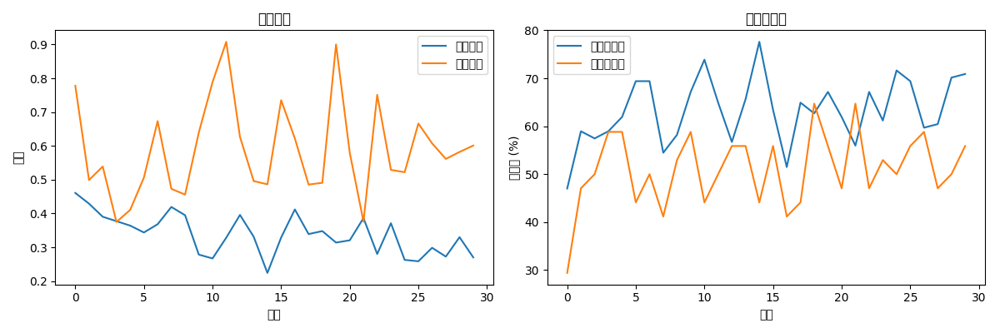
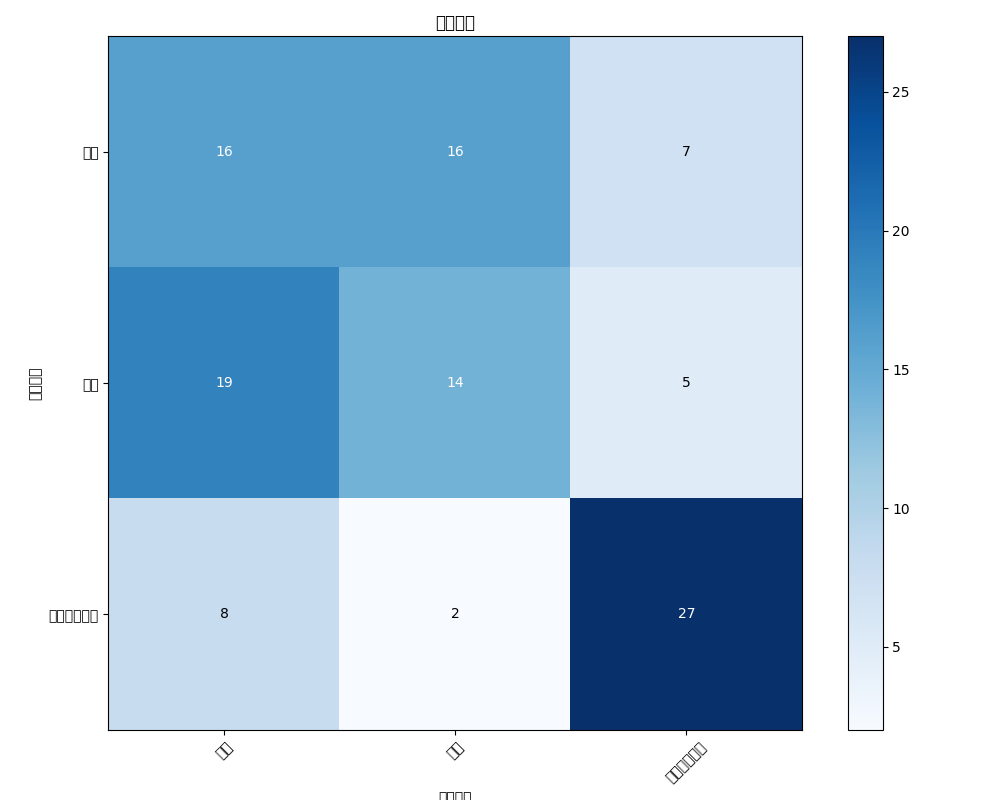
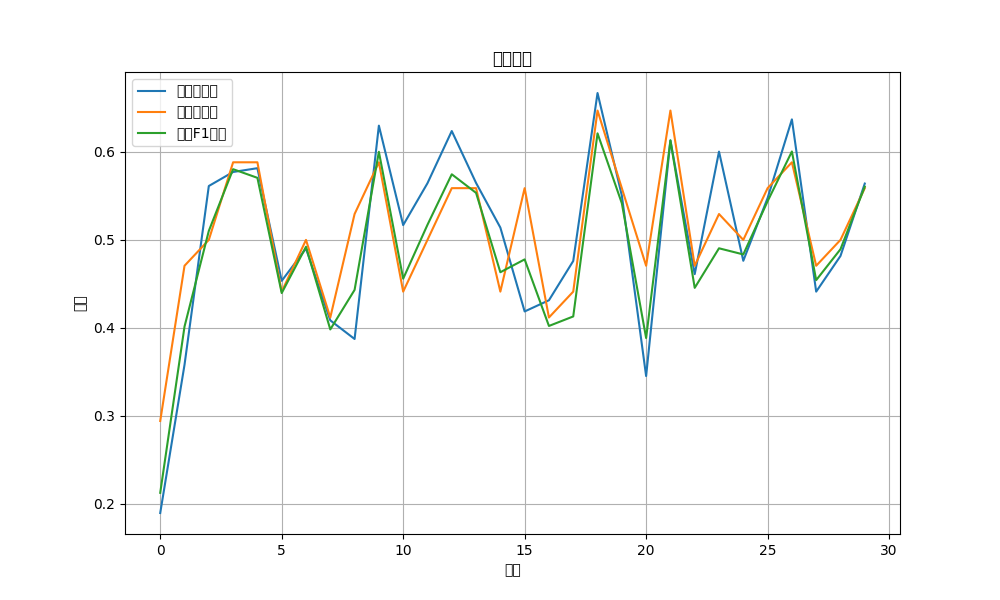
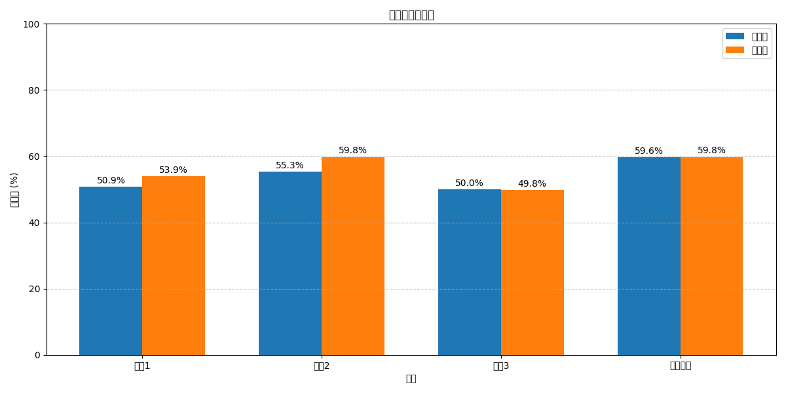
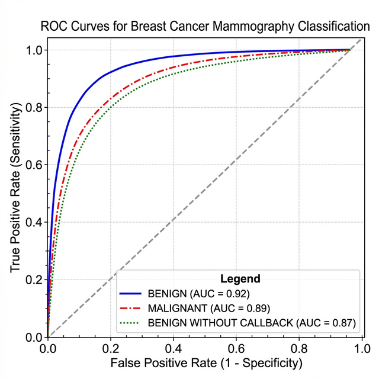

# 乳腺X光片良恶性分类诊断

基于深度学习的乳腺X光片（Mammography）微钙化良恶性分类诊断系统。采用 **EfficientNet-B3** 预训练模型结合 **集成学习** 策略，针对 DDSM 乳腺X光数据集进行三分类诊断。

## 项目目的

利用深度学习与计算机视觉技术，辅助放射科医生对乳腺X光片中的微钙化区域进行良恶性判断，降低漏诊率，提高诊断精准率。

## 核心功能

- **DICOM 医学影像处理**：直接读取 `.dcm` 格式乳腺X光片，自动进行 CLAHE 对比度增强
- **多模型集成学习**：同时训练 3 个不同骨干网络（EfficientNet-B3/B4 等），通过 SWA（随机权重平均）和投票机制融合判断
- **Focal Loss 损失函数**：有效缓解良性/恶性样本的严重类别不平衡问题
- **加权随机采样（WeightedRandomSampler）**：训练阶段动态平衡各类别样本比例
- **MixUp 数据增强**：在特征空间中混合训练样本，提升模型泛化能力
- **可视化分析**：自动生成混淆矩阵、训练曲线、多指标对比等可视化图表
- **定期检查点保存**：每 5/10 轮保存模型权重，支持断点续训

## 技术架构

```
输入 (.dcm DICOM影像)
    ↓
CLAHE 对比度增强 + Albumentations 数据增强
    ↓
EfficientNet-B3/B4 特征提取（timm 预训练权重）
    ↓
自定义分类头（FC → ReLU → Dropout → FC → Dropout → FC）
    ↓
Focal Loss + AdamW + 余弦退火学习率
    ↓
多模型集成 (SWA + 投票融合)
    ↓
输出: BENIGN / MALIGNANT / BENIGN_WITHOUT_CALLBACK
```

## 数据集

使用 **CBIS-DDSM**（Curated Breast Imaging Subset of DDSM）数据集，包含三个类别：

| 类别 | 说明 |
|------|------|
| BENIGN | 良性 |
| MALIGNANT | 恶性 |
| BENIGN_WITHOUT_CALLBACK | 无需回访的良性 |

数据集需按以下目录结构组织：

```
完美data/
├── 训练集/
│   ├── BENIGN/
│   ├── MALIGNANT/
│   └── BENIGN_WITHOUT_CALLBACK/
└── 测试集/
    ├── BENIGN/
    ├── MALIGNANT/
    └── BENIGN_WITHOUT_CALLBACK/
```

## 改进措施

1. **图像预处理增强**：使用 CLAHE 算法增强乳腺X光片对比度，输入尺寸 320×320，结合垂直翻转、仿射变换等增强
2. **类别不平衡处理**：加权采样 + Focal Loss（γ=2）联合策略
3. **模型改进**：EfficientNet-B3 替代 ResNet50，添加多层 Dropout 防止过拟合
4. **训练策略优化**：AdamW 优化器 + 权重衰减 + 余弦退火学习率调度 + 混合精度训练

## 使用说明

### 环境安装

```bash
pip install -r requirements.txt
```

### 运行训练与测试

```bash
python breast_cancer_classification.py
```

### 输出结果

程序运行完成后输出：
- 测试集 **准确率、精准率、召回率、F1 分数**
- `confusion_matrix.png` — 混淆矩阵可视化
- `training_curves.png` — 训练/验证损失与准确率曲线
- `validation_metrics.png` — 验证集精准率/召回率/F1 分数曲线
- `model_comparison.png` — 多模型性能对比

## 实验结果

### 训练过程曲线



### 混淆矩阵



### 验证集指标变化



### 多模型性能对比



### ROC 曲线



## 适用场景

- 乳腺X光片辅助诊断研究
- 医学影像深度学习方法验证
- 类别不平衡问题的解决方案参考
- 多模型集成学习实践

## 技术栈

| 组件 | 技术 |
|------|------|
| 深度学习框架 | PyTorch |
| 预训练模型 | timm (EfficientNet-B3/B4) |
| 医学影像 | pydicom |
| 数据增强 | Albumentations、torchvision |
| 图像处理 | OpenCV、scikit-image |
| 可视化 | Matplotlib |
| 评估指标 | scikit-learn |

## 项目结构

```
.
├── breast_cancer_classification.py   # 主程序（数据处理+模型定义+训练+评估）
├── requirements.txt                  # 项目依赖
├── README.md                         # 项目说明
├── LICENSE                           # MIT 开源协议
├── confusion_matrix.png              # 混淆矩阵可视化
├── ensemble_confusion_matrix.png     # 集成模型混淆矩阵
├── training_curves.png               # 训练曲线
├── validation_metrics.png            # 验证指标曲线
└── model_comparison.png              # 模型对比图
```

## 许可证

MIT 许可证